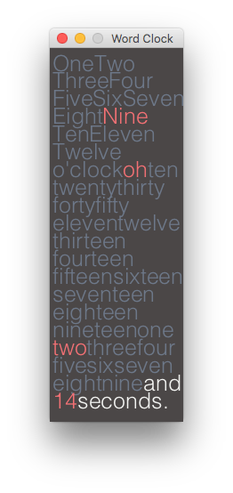
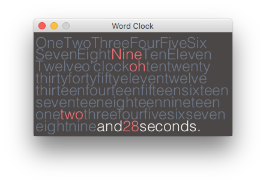

# Word Clock

### by [Mitchell Griest](mailto:mdgriest@crimson.ua.edu)

Word Clock was created using [Processing 3](https://processing.org/)

It is a simple application that displays the current time (based on your machine's time and date) using words.

## Getting Started

The sketch can be run from Processing directly or by running the appropriate application file for your operating system.

To run Word Clock, you will need to have Java 8 installed on your machine. You can download it [here](http://www.oracle.com/technetwork/java/javase/downloads/index.html).

## Out-of-the-Box Customization

### Clock size

By default, the clock is tall and thin so that it can live on the side of your desktop without taking up too much real estate.

However, the clock is resizable, so feel free to set it up however you like!

### Font Size

You can also increase and decrease the size of the font by using the `]` and `[` keys, respectively.

## Feel free to alter the code to your taste

I have included a few notes where I anticipate you may want to make changes. For example, if you prefer a differnt typeface, color scheme, or default size for the clock, just update the appropriate lines in the sketch (`wordClock.pde`)

## Have fun!

The Word Clock is something I built in an afternoon for fun. There is certainly plenty of room for improvement in the way things work under the hood, but it does what it is supposed to and looks good while doing it. If you find any major flaws in the program, please feel free to write an Issue describing them and I will patch things up in the future.

Best,

Mitchell Griest
